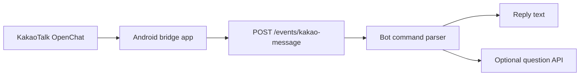

# kakao-openchat-bot-bridge

카카오톡 오픈채팅 사설봇을 직접 운영하기 위한 오픈소스 브리지입니다.

공식 카카오톡 봇 API가 아닌, Android 메신저봇R 계열 앱이나 서브폰 자동화 앱에서 보이는 메시지를 웹훅으로 넘겨 처리하는 구조입니다. 던파 모바일 뉴비 훈련소 방장 운영 경험에서 분리한 공개용 코어이며, 운영방 이름 / 개인 로그 / 실제 API 키 / 배포 서버 정보는 포함하지 않았습니다.

## 무엇을 해주나요?

- `/핑` 같은 기본 명령 처리
- `/질문 내용` 또는 `@봇 질문 올려줘 내용` 감지
- 선택적으로 외부 질문 게시판 API에 질문 등록
- `/공지`, `/공지설정`, `/가이드`, `/가이드추가` 같은 운영 보조 명령
- 방 allowlist, 봇 닉네임 ignore, 관리자 닉네임 제한
- JSON webhook 응답 또는 카톡 앱이 그대로 돌려줄 수 있는 plain text 응답
- 로컬 `data/events.jsonl`, `data/state.json` 기반 간단한 상태 저장

## 구조



코드 위치:

- `src/index.mjs` — CLI entrypoint.
- `src/presentation/` — HTTP webhook server.
- `src/application/` — bot command handling.
- `src/infrastructure/` — JSON store and optional question API adapter.
- `src/security/` — webhook HMAC/secret validation.
- `src/config/` — environment parsing and data-dir setup.

## 주의

- 이 프로젝트는 Kakao Corp.와 무관한 비공식 예제입니다.
- 오픈채팅방 참여자에게 봇 사용 사실과 메시지 처리 방식을 공지하는 것을 권장합니다.
- 카카오톡 앱/자동화 앱/호스팅 서비스의 약관과 운영 정책은 직접 확인하세요.
- 비밀키는 공개 저장소, 프론트엔드 번들, 카톡방에 올리지 마세요.
- 공개 레포에는 실제 채팅 로그를 올리지 마세요.

## 빠른 시작

```bash
git clone <repo-url>
cd kakao-openchat-bot-bridge
cp .env.example .env
npm start
```

Windows PowerShell:

```powershell
Copy-Item .env.example .env
npm start
```

서버가 뜨면:

```text
kakao-openchat-bot-bridge listening on http://0.0.0.0:4040
```

헬스 체크:

```bash
curl http://localhost:4040/health
```

PowerShell:

```powershell
Invoke-RestMethod http://localhost:4040/health
```

## 환경변수

| 이름 | 설명 |
| --- | --- |
| `KAKAO_BOT_HOST` | 서버 listen host. 기본값 `0.0.0.0` |
| `KAKAO_BOT_PORT` | 서버 port. 기본값 `4040` |
| `KAKAO_BOT_SECRET` | bridge app과 공유하는 webhook 비밀값 |
| `KAKAO_WEBHOOK_HMAC_SECRET` | 선택. raw body HMAC 검증용 secret |
| `KAKAO_WEBHOOK_HMAC_MAX_SKEW_MS` | HMAC timestamp 허용 오차 |
| `KAKAO_ALLOW_INSECURE_WEBHOOK` | secret 없는 격리 로컬 테스트에서만 `true` |
| `KAKAO_WEBHOOK_TIMEOUT_MS` | webhook 응답 timeout |
| `KAKAO_BATCH_MAX_MESSAGES` | batch webhook 최대 메시지 수 |
| `KAKAO_ROOM_ALLOWLIST` | 반응할 방 이름 목록. 쉼표 구분. 비우면 모든 방 허용 |
| `KAKAO_ALLOW_ALL_ROOMS` | production에서 모든 방 허용이 명시 의도일 때만 `true` |
| `KAKAO_BOT_NICKNAMES` | 봇 자신의 닉네임 목록. 자기 응답 루프 방지 |
| `KAKAO_ADMIN_SENDERS` | `/공지설정`, `/가이드추가` 가능한 관리자 닉네임 |
| `KAKAO_ALLOW_SENDER_ADMIN_COMMANDS` | 닉네임 기반 관리자 명령 허용. 기본 비활성 권장 |
| `KAKAO_BOT_MENTION` | 멘션 트리거. 기본값 `@봇` |
| `KAKAO_BOT_DATA_DIR` | 상태/이벤트 로그 저장 폴더 |
| `QUESTION_API_ENDPOINT` | 선택. `/질문`을 전달할 외부 API endpoint |
| `QUESTION_API_SECRET` | 선택. 외부 API 호출용 secret |
| `QUESTION_API_TIMEOUT_MS` | 질문 API 호출 timeout |
| `QUESTION_DEDUPE_TTL_MS` | 중복 질문 방지 TTL |
| `PUBLIC_BASE_URL` | 선택. 응답 URL 보정용 public base URL |

## 웹훅 테스트

```bash
curl -X POST "http://localhost:4040/events/kakao-message?format=text" \
  -H "content-type: application/json" \
  -H "x-bot-secret: change-this-long-random-secret" \
  -d '{"room":"테스트방","sender":"방장","text":"/핑"}'
```

PowerShell:

```powershell
Invoke-RestMethod `
  -Method Post `
  -Uri "http://localhost:4040/events/kakao-message?format=text" `
  -Headers @{ "x-bot-secret" = "change-this-long-random-secret" } `
  -ContentType "application/json" `
  -Body '{"room":"테스트방","sender":"방장","text":"/핑"}'
```

웹훅 인증은 `KAKAO_BOT_SECRET` legacy secret, `KAKAO_WEBHOOK_HMAC_SECRET` HMAC-only, 또는 둘 다 통과해야 하는 defense-in-depth 모드로 운영할 수 있습니다. HMAC을 켜면 요청마다 `x-bot-timestamp`, `x-bot-nonce`, `x-bot-signature`가 필요하고, signature 원문은 실제 raw body 기준의 `${timestamp}.${nonce}.${rawBody}`입니다.

## 메신저봇R 예시

[examples/messenger-bot-r.js](examples/messenger-bot-r.js)를 Android 메신저봇R 계열 앱에 붙여 넣고 아래 값만 바꾸세요.

```js
const BOT_ENDPOINT = "https://your-domain.example/events/kakao-message?format=text";
const BOT_SECRET = "your-long-random-secret";
```

로컬 PC에서 테스트할 때는 같은 와이파이에 있는 Android 기기 기준으로 PC의 LAN IP를 넣습니다.

```js
const BOT_ENDPOINT = "http://192.168.0.10:4040/events/kakao-message?format=text";
```

## 명령어

| 명령 | 설명 |
| --- | --- |
| `/핑` | 봇 상태 확인 |
| `/도움`, `/봇도움` | 명령어 안내 |
| `/공지` | 저장된 공지 확인 |
| `/공지설정 내용` | 관리자 전용. 공지 저장 |
| `/가이드` | 저장된 가이드 목록 |
| `/가이드추가\n제목\nhttps://example.com` | 관리자 전용. 가이드 추가 |
| `/질문 내용` | 질문을 외부 API로 등록하거나 접수 안내 |
| `@봇 질문 올려줘 내용` | 멘션 기반 질문 등록 |

## 질문 API 연동

`QUESTION_API_ENDPOINT`가 있으면 `/질문` 명령을 아래 JSON으로 POST합니다.

```json
{
  "title": "질문: 초대장 어디서 얻나요?",
  "body": "초대장 어디서 얻나요?",
  "authorName": "카톡:질문자",
  "room": "테스트방",
  "sender": "질문자",
  "source": "kakao-openchat"
}
```

응답 JSON에 `url`, `postUrl`, `id` 중 하나가 있으면 카톡 답장에 포함합니다.

## 배포 팁

- 운영에서는 HTTPS 뒤에 두세요.
- Nginx/Caddy로 `/events/kakao-message`만 외부 공개하는 것을 권장합니다.
- `KAKAO_BOT_SECRET`은 32자 이상 랜덤 문자열을 권장합니다.
- `data/events.jsonl`에는 방 이름/닉네임/메시지가 들어갈 수 있으니 공개 저장소에 올리지 마세요.

## 개발

```bash
npm test
node src/index.mjs test-message --room 테스트방 --sender 방장 --text /핑
```

## 라이선스

MIT
